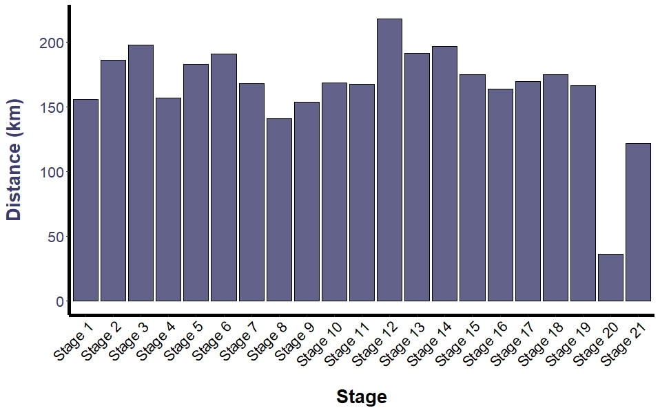
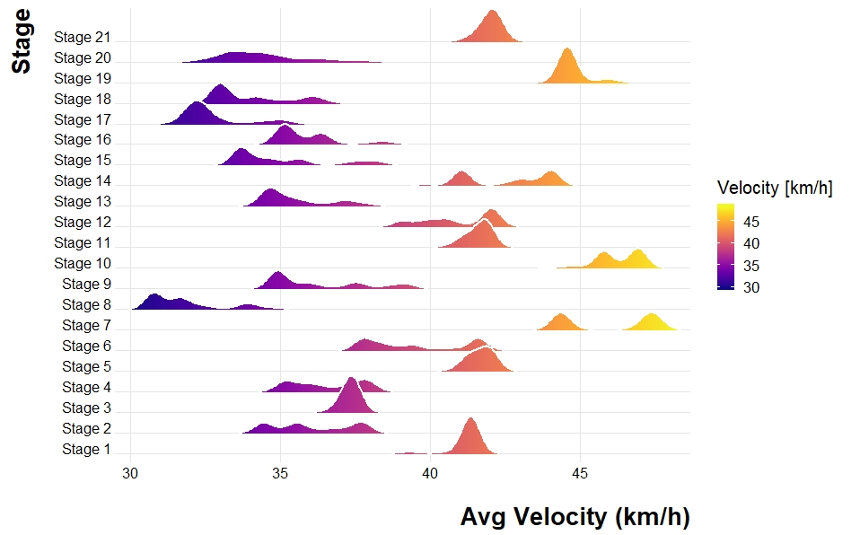
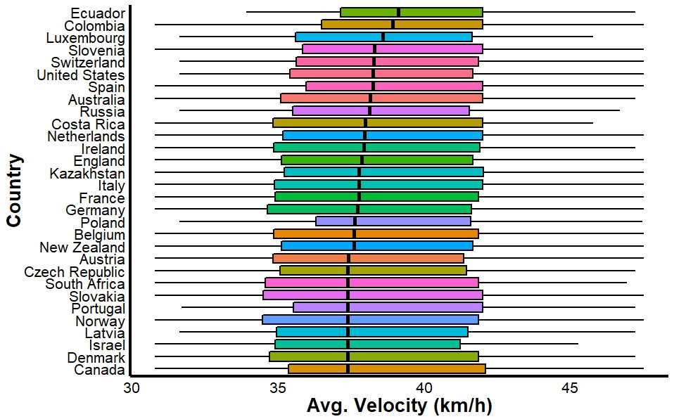
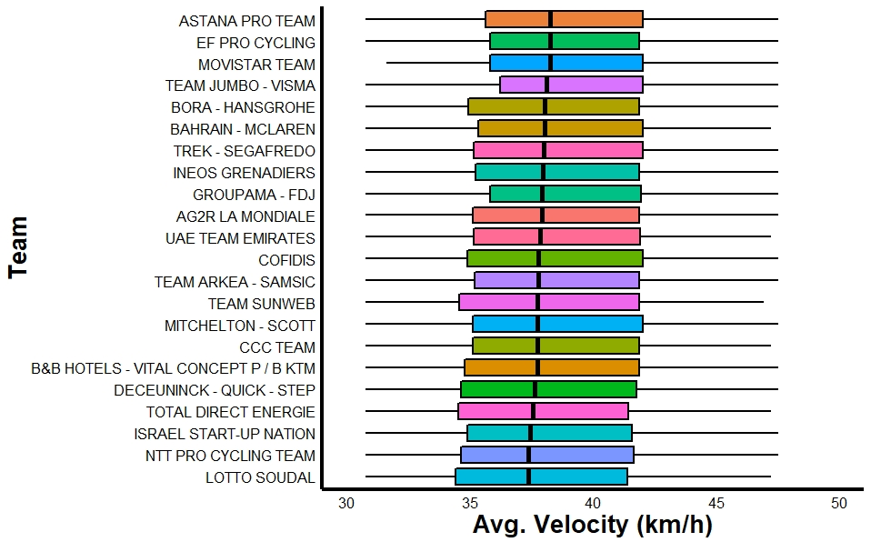
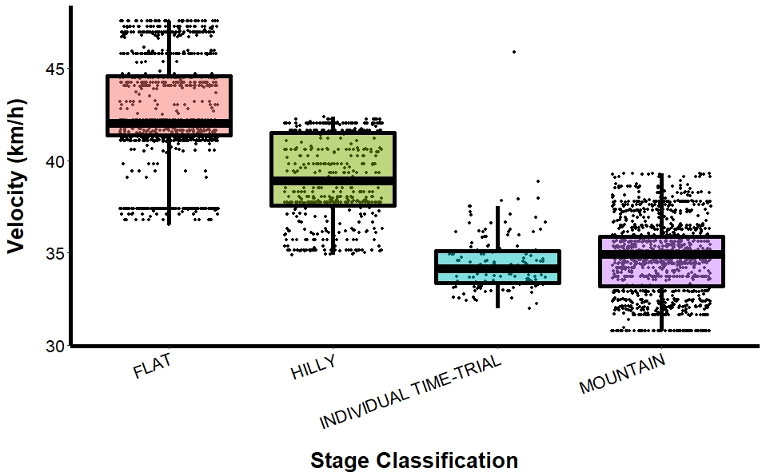

# Tour de France
This repository hosts data and scripts related to the Tour de France. 

---

# 2020 Tour de France 
### Data Visualization
Script: code/tdf_2020_viz.R

Libraries: ggplot2, tidyverse, reshape2, viridis, ggjoy 

### Distance per stage (basic bar plot)

### Velocity distributions per stage (ridgeline plot)

### Velocity distributions by country (box plot)

### Velocity distributions by team (box plot)

### Velocity distributions by stage type (box plot + dot plot)

